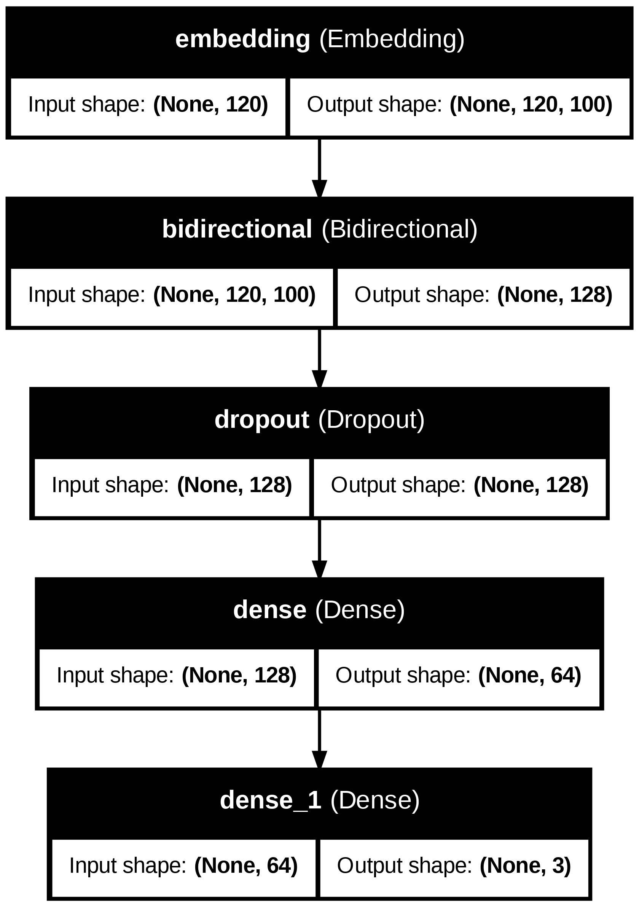
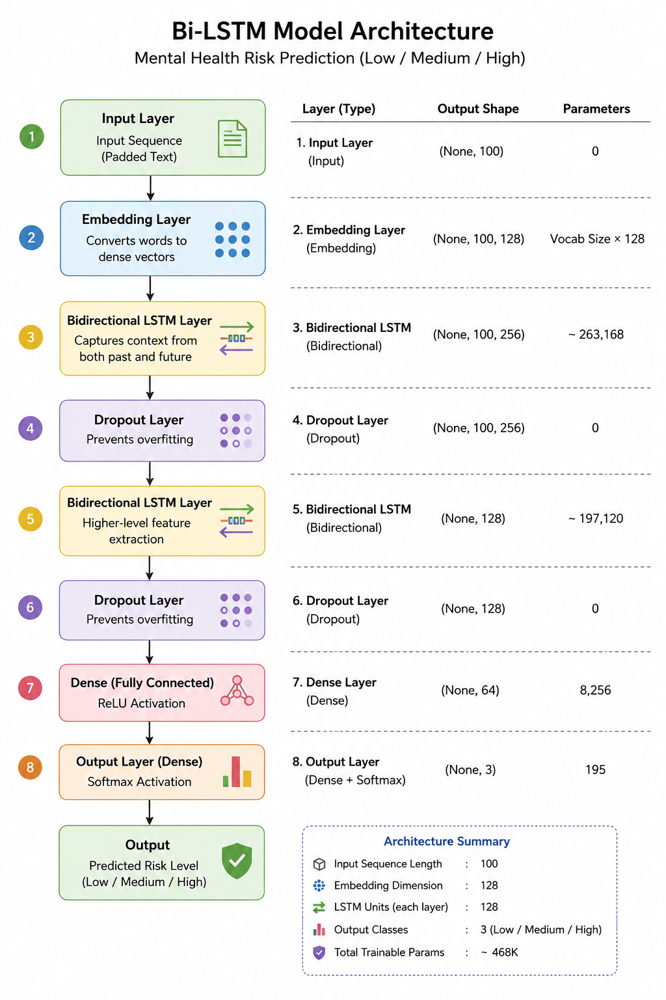
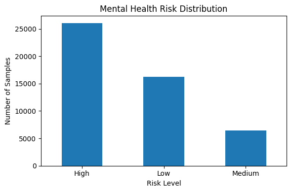
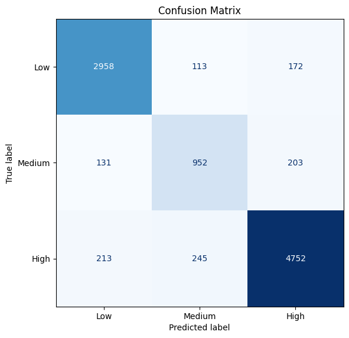
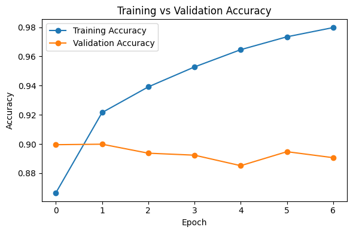

# Explainable Deep Learning Framework for Early Mental Health Risk Prediction Using Bi-LSTM


[](https://colab.research.google.com/github/YOUR_USERNAME/mental-health-risk-prediction-bilstm/blob/main/notebook/Mental_Health_BiLSTM.ipynb)

---
## Overview
This project predicts **mental health risk levels (Low, Medium, High)** from textual statements using a **Bi-directional Long Short-Term Memory (Bi-LSTM)** model. The framework focuses on **early risk assessment** and integrates **Explainable AI (XAI)** to improve transparency and interpretability of predictions.

The proposed system is designed as a **preventive mental healthcare analytics framework** rather than a direct clinical diagnosis tool.

---

## Proposed Workflow



---

## Model Architecture



---

## Dataset

**Source:** Kaggle – *Sentiment Analysis for Mental Health*

🔗 https://www.kaggle.com/datasets/suchintikasarkar/sentiment-analysis-for-mental-health

### Original Labels
- Normal
- Stress
- Anxiety
- Depression
- Suicidal

### Risk-Level Reformulation
- **Low Risk:** Normal
- **Medium Risk:** Stress, Anxiety
- **High Risk:** Depression, Suicidal

### Dataset Distribution

| Risk Level | Labels Included | Count |
|------------|----------------|------:|
| Low | Normal | 16,213 |
| Medium | Stress, Anxiety | 6,428 |
| High | Depression, Suicidal | 26,051 |



---

## Results

### Confusion Matrix



### Training vs Validation Accuracy



---

## Key Features

- Text preprocessing and cleaning
- Multi-level mental health risk prediction
- Bi-LSTM deep learning model
- Explainable AI (XAI)
- Early risk assessment framework
- Evaluation using Accuracy, Precision, Recall, F1-score, and Confusion Matrix

---

## Tech Stack

- Python
- TensorFlow / Keras
- Scikit-learn
- Pandas
- NumPy
- Matplotlib
- Google Colab

---

## Repository Structure

```text
mental-health-risk-prediction-bilstm/
├── notebook/
│   └── Mental_Health_BiLSTM.ipynb
├── paper/
│   └── research_report.pdf
├── figures/
│   ├── workflow_pipeline.png
│   ├── model_architecture.png
│   ├── confusion_matrix.png
│   ├── accuracy_curve.png
│   └── risk_distribution.png
├── requirements.txt
└── README.md
```

---

## Research Contribution

This project introduces a **multi-level mental health risk prediction framework** with integrated explainability, enabling **early and interpretable mental health assessment** from textual data.


---

## Author

**Piyush Kumar**  
B.E. CSE (AI & ML), Chandigarh University

---

## License

This project is intended for **educational and research purposes only**.
